# 1. Mục đích tài liệu

Tài liệu này được biên soạn để bàn giao cho khách hàng, giúp người dùng cuối nắm rõ cách sử dụng hệ thống quản lý thang máy trong vận hành hằng ngày.

Nội dung tập trung vào:

- Quy trình thao tác thực tế theo từng phân hệ.
- Cách phối hợp giữa các vai trò (Admin/User).
- Các tình huống thường gặp và cách xử lý.
- Hình ảnh minh họa trực quan để dễ áp dụng.

# 2. Đối tượng sử dụng

- **Quản trị viên (Admin):** quản lý dữ liệu, người dùng, phân công công việc, giám sát tiến độ.
- **Nhân viên/Kỹ thuật viên (User):** tiếp nhận và xử lý các công việc được phân công, cập nhật trạng thái.
- **Bộ phận vận hành:** theo dõi báo lỗi, lịch bảo trì, tiến độ xử lý.

# 3. Tổng quan hệ thống

## 3.1 Luồng sử dụng chính

1. Đăng nhập hệ thống.
2. Theo dõi nhanh trên Dashboard.
3. Quản lý thông tin khách hàng/hợp đồng/thang máy.
4. Ghi nhận báo lỗi và theo dõi lịch bảo trì.
5. Theo dõi đơn bảo trì, xử lý công việc theo phân công.
6. Nhận thông báo và phản hồi kịp thời.

## 3.2 Giao diện tổng thể

Hệ thống gồm ba khu vực:

- **Menu bên trái:** chuyển phân hệ.
- **Thanh trên cùng:** thông báo, thông tin tài khoản, đăng xuất.
- **Khu vực nội dung:** danh sách, biểu mẫu, báo cáo tổng quan.

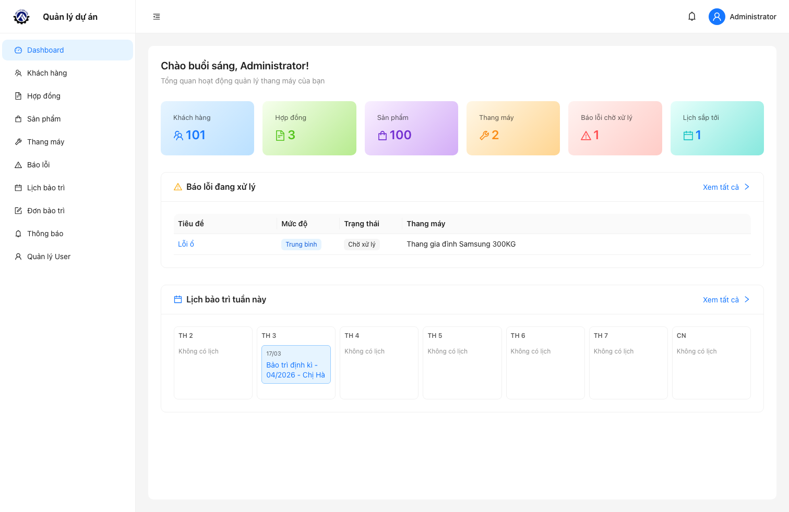

# 4. Đăng nhập và bảo mật tài khoản

## 4.1 Các bước đăng nhập

1. Mở đường dẫn hệ thống được bàn giao.
2. Nhập email và mật khẩu.
3. Nhấn **Đăng nhập**.

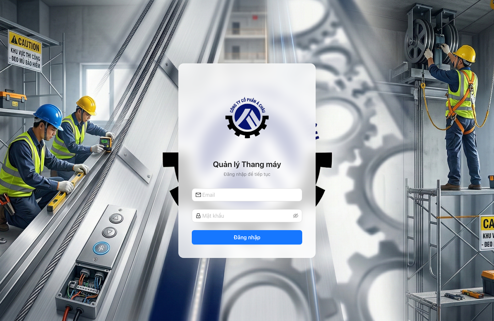

## 4.2 Khuyến nghị bảo mật

- Không chia sẻ tài khoản cho người không liên quan.
- Đăng xuất sau khi hoàn thành công việc.
- Đổi mật khẩu định kỳ theo quy định nội bộ.
- Báo ngay cho quản trị viên khi phát hiện đăng nhập bất thường.

# 5. Phân quyền người dùng

## 5.1 Quyền Admin

- Toàn quyền xem/thêm/sửa/xóa dữ liệu các phân hệ.
- Quản lý tài khoản người dùng.
- Phân công đơn bảo trì cho kỹ thuật viên.
- Theo dõi toàn bộ thông báo và tiến độ xử lý.

## 5.2 Quyền User

- Xem các module được cấp quyền.
- Tạo/cập nhật báo lỗi theo phạm vi được phép.
- Theo dõi **Công việc của tôi** khi đã được giao việc.

# 6. Hướng dẫn chi tiết theo phân hệ

## 6.1 Dashboard

**Mục đích:** theo dõi nhanh tình trạng vận hành hệ thống.

**Thông tin chính trên màn hình:**

- Số lượng khách hàng, hợp đồng, sản phẩm, thang máy.
- Số báo lỗi đang chờ xử lý.
- Lịch bảo trì sắp tới trong tuần.

**Thao tác:**

- Nhấn vào thẻ thống kê để mở danh sách chi tiết.
- Chọn dòng báo lỗi để xem thông tin xử lý.
- Chọn lịch bảo trì để đi đến đơn bảo trì liên quan.

## 6.2 Quản lý khách hàng

### 6.2.1 Màn hình danh sách khách hàng

- Tìm kiếm theo mã khách hàng, tên, email, số điện thoại.
- Với Admin: thêm/sửa/xóa, xóa hàng loạt, xuất Excel.
- Nhấn tên khách hàng để mở trang chi tiết.

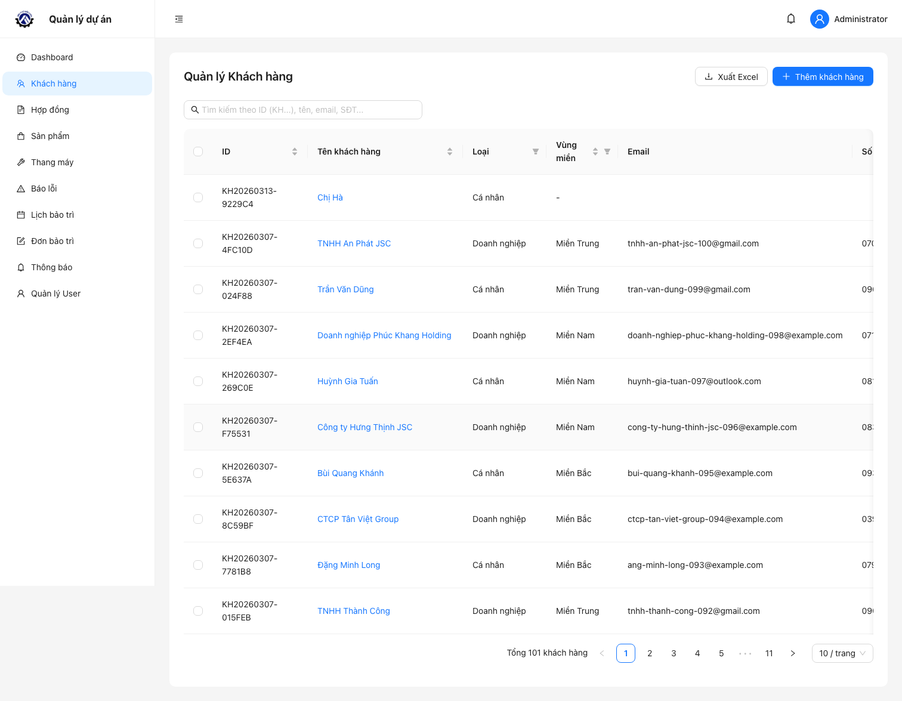

### 6.2.2 Màn hình thêm khách hàng

Đường dẫn thao tác: **Khách hàng** → **Thêm khách hàng**.

Các trường quan trọng:

- ID khách hàng: hệ thống tự sinh.
- Loại khách hàng: cá nhân/doanh nghiệp.
- Tỉnh/Thành phố và Quận/Huyện (bắt buộc).
- Địa chỉ chi tiết, khu vực, ghi chú.

**Logic nghiệp vụ áp dụng:**

- Khi chọn tỉnh/thành phố, danh sách quận/huyện sẽ đổi theo tỉnh đã chọn.
- Khi đổi tỉnh, trường quận/huyện được reset để tránh lưu sai dữ liệu.
- Form tạo mới sẽ gọi API cấp ID tự động trước khi lưu.

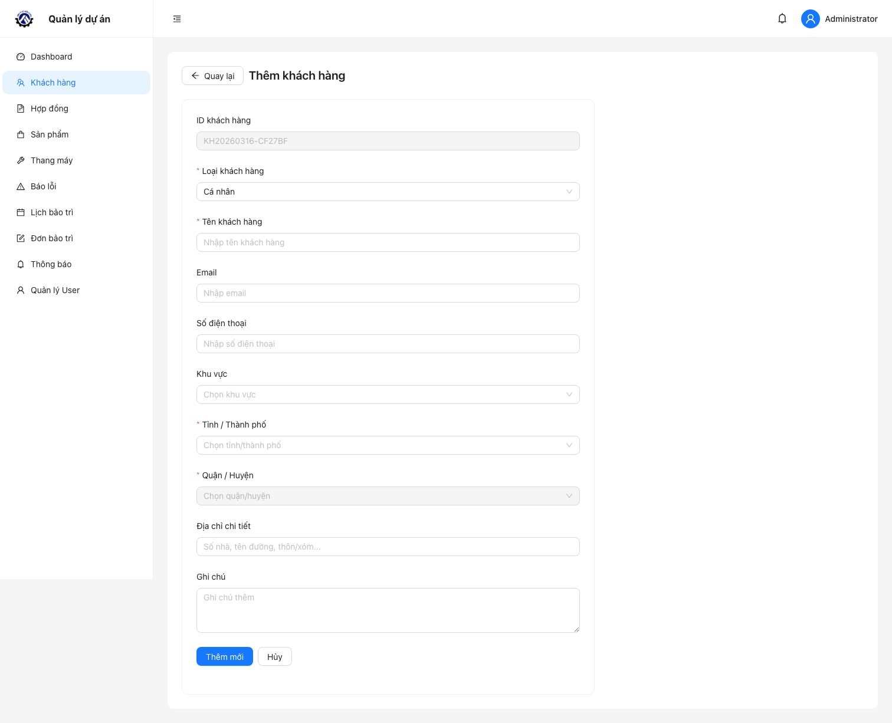

### 6.2.3 Màn hình chi tiết khách hàng

Hiển thị:

- Thông tin hồ sơ khách hàng đầy đủ.
- Danh sách hợp đồng của khách hàng ngay bên dưới.

**Logic nghiệp vụ áp dụng:**

- Mỗi hợp đồng trong bảng có thể mở trực tiếp sang **Chi tiết hợp đồng**.
- Đây là điểm bắt đầu để truy vết từ khách hàng → hợp đồng → lịch bảo trì/đơn bảo trì.

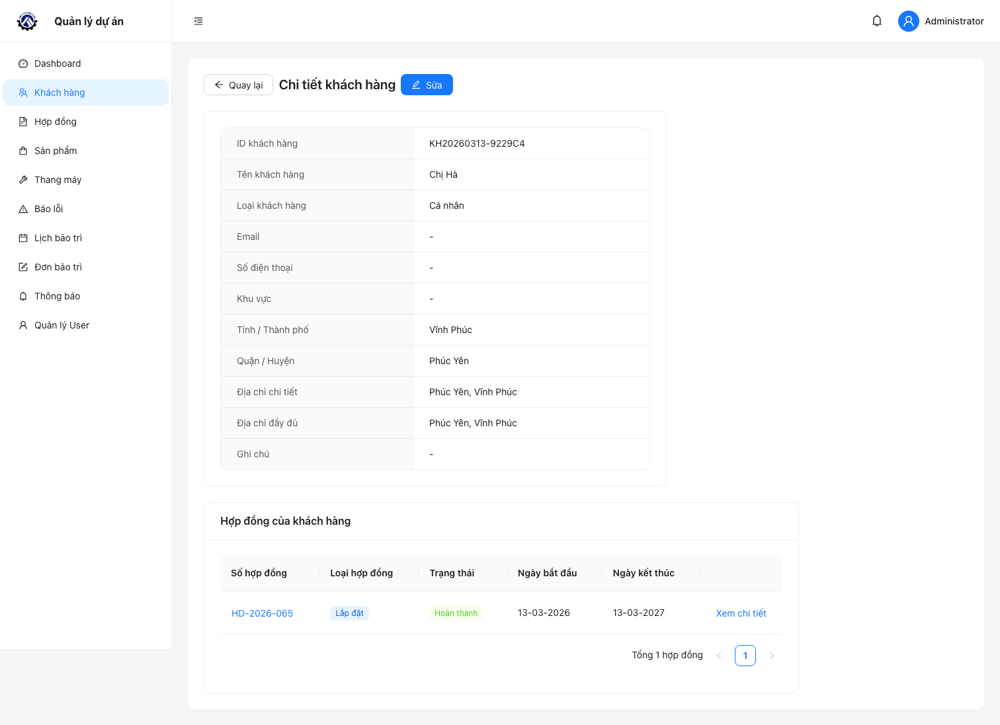

## 6.3 Quản lý hợp đồng

### 6.3.1 Màn hình danh sách hợp đồng

- Tìm theo số hợp đồng.
- Lọc theo trạng thái, loại hợp đồng, bảo hành, ngày tạo.
- Cập nhật nhanh trạng thái hợp đồng.
- Với Admin: thêm/sửa/xóa và xuất Excel.

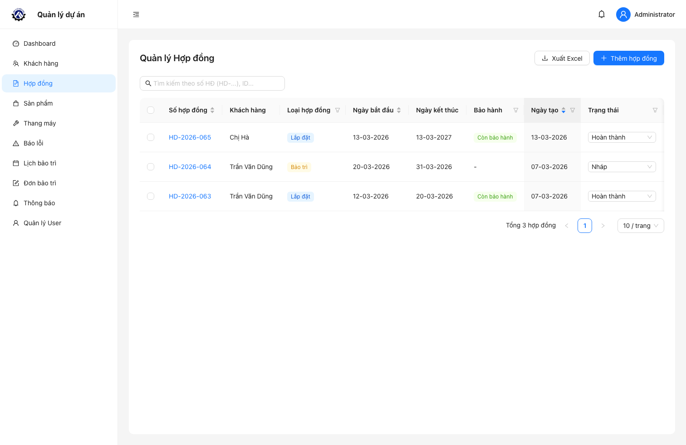

### 6.3.2 Màn hình chi tiết hợp đồng

Hiển thị:

- Thông tin hợp đồng (loại, trạng thái, thời gian, tần suất bảo trì).
- Thông tin khách hàng liên kết.
- Danh sách sản phẩm/thang máy trong hợp đồng.
- Lịch sử bảo trì gồm:
  - Lịch bảo trì định kỳ
  - Báo lỗi/bảo dưỡng phát sinh

**Logic nghiệp vụ áp dụng ngay trong module hợp đồng:**

- Hệ thống chỉ tự sinh lịch bảo trì định kỳ khi hợp đồng:
  - Loại `installation`
  - Trạng thái `completed`
  - Có đủ ngày bắt đầu, ngày kết thúc, tần suất
  - Có item thang máy
- Công thức sinh lịch:
  - Mốc đầu = `start_date + maintenance_frequency_per_month`
  - Lặp theo chu kỳ tháng đến trước/đúng `end_date`
- Chống trùng lịch theo bộ khóa:
  - `contract_id + elevator_id + scheduled_date`
- Mỗi lịch định kỳ tương ứng đúng 1 đơn bảo trì.

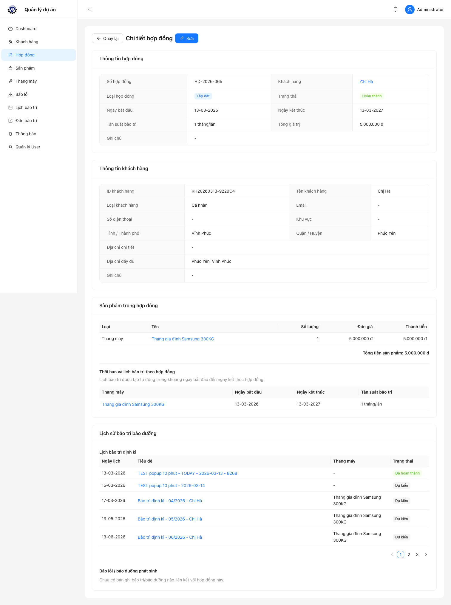

## 6.4 Quản lý thang máy

### 6.4.1 Màn hình thêm thang máy

Đường dẫn thao tác: **Thang máy** → **Thêm thang máy**.

Các trường chính:

- ID thang máy: hệ thống tự sinh.
- Tên thang máy, loại, thương hiệu, model.
- Ảnh thang máy (upload).
- Tải trọng, tốc độ, mô tả.

**Logic nghiệp vụ áp dụng:**

- Chỉ chấp nhận file ảnh khi upload.
- Dung lượng ảnh tối đa 5MB.
- Khi tạo mới, tải trọng và tốc độ có mặc định 0 để tránh dữ liệu rỗng.

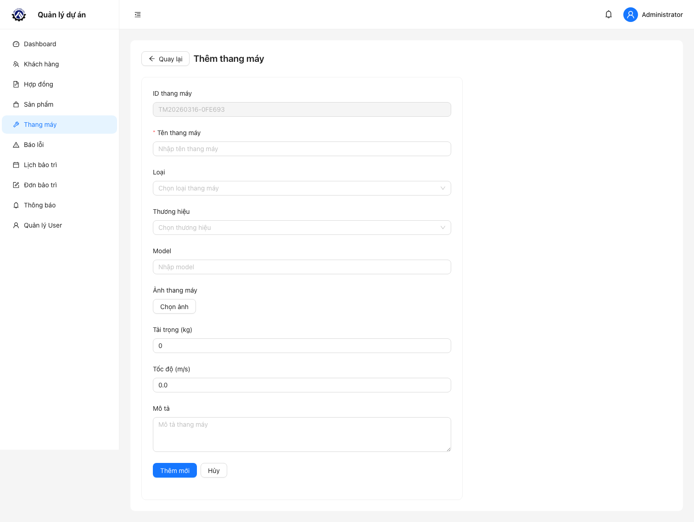

## 6.5 Quản lý báo lỗi

**Mục đích:** ghi nhận sự cố và điều phối xử lý.

**Thao tác thường dùng:**

- Tạo báo lỗi mới.
- Lọc theo trạng thái và tìm kiếm theo tiêu đề.
- Theo dõi mức độ ưu tiên: thấp/trung bình/cao/nghiêm trọng.
- Với Admin: cập nhật trạng thái và xóa dữ liệu.

**Trạng thái xử lý báo lỗi:**

- Chờ xử lý
- Đang xử lý
- Đã xử lý
- Đã đóng

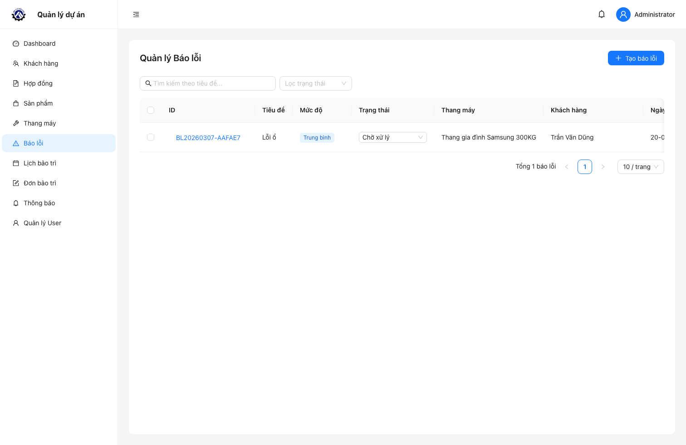

## 6.6 Lịch bảo trì

**Mục đích:** theo dõi lịch công việc theo ngày/tuần/tháng và đồng bộ lịch dùng chung.

**Thao tác thường dùng:**

- Chuyển chế độ xem: tháng/tuần/ngày/lịch trình.
- Lọc loại sự kiện (bảo trì định kỳ hoặc báo lỗi).
- Mở popup chi tiết sự kiện.
- Sao chép link chia sẻ để đưa lịch vào Google Calendar.
- Với Admin: dùng nút **Resync ngay** để đồng bộ lại dữ liệu lịch.

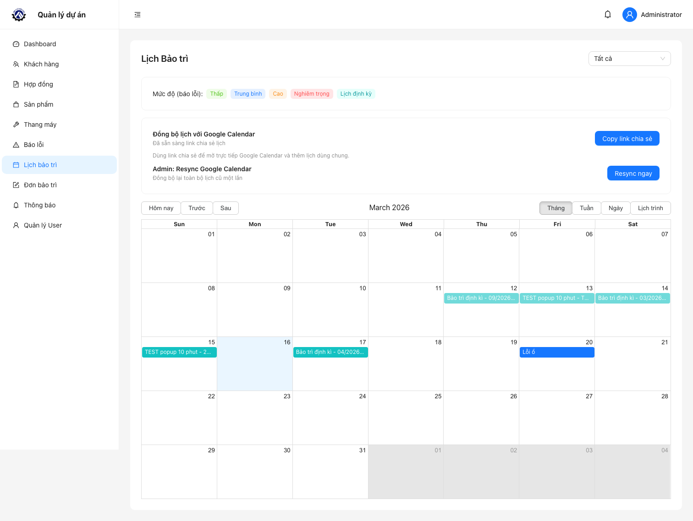

**Logic nghiệp vụ áp dụng trong màn hình lịch:**

- Admin nhìn thấy toàn bộ lịch định kỳ.
- User chỉ nhìn thấy lịch định kỳ có liên kết với đơn bảo trì mà user đang được gán.
- Nếu click vào sự kiện định kỳ, hệ thống mở chi tiết đơn theo `scheduleId`; nếu chưa có đơn (dữ liệu cũ) thì backend tự tạo đơn bù.

## 6.7 Đơn bảo trì (Admin) / Công việc của tôi (User)

### 6.7.1 Màn hình danh sách đơn bảo trì

- Tìm theo khách hàng/hợp đồng/thang máy.
- Lọc theo trạng thái: dự kiến, đang thực hiện, đã hoàn thành, đã hủy.
- Với Admin: lọc theo người được giao, theo dõi việc đã giao.
- Mở **Chi tiết** để cập nhật tiến độ công việc.

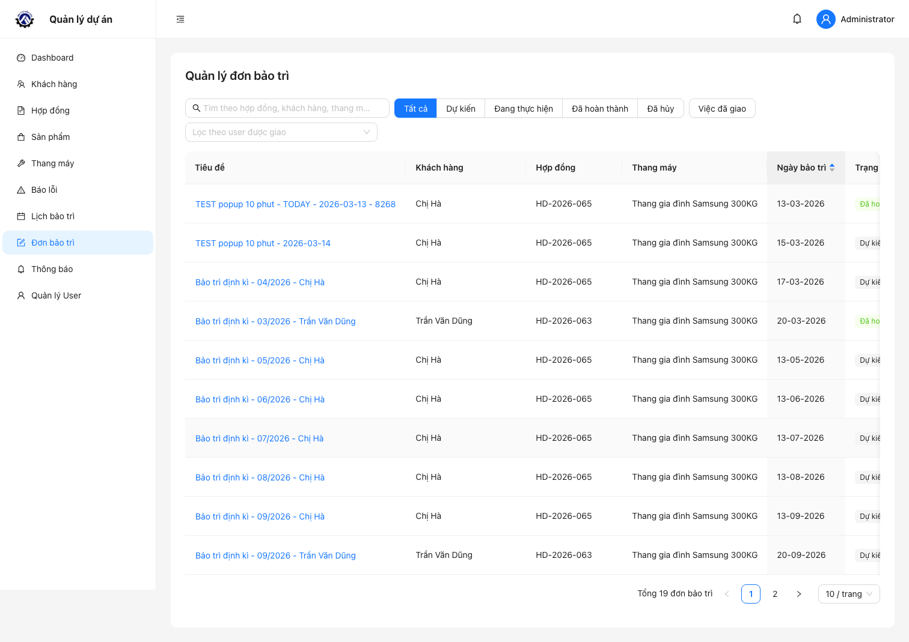

### 6.7.2 Màn hình chi tiết đơn bảo trì

Hiển thị:

- Thông tin khách hàng, hợp đồng, thang máy, ngày bảo trì.
- Trạng thái xử lý và người phụ trách.
- Nội dung công tác.
- Vật tư sử dụng và giá thành.

**Logic nghiệp vụ áp dụng:**

- Quyền sửa:
  - Admin sửa toàn bộ.
  - User chỉ sửa được đơn được gán cho chính mình.
- Trạng thái được phép cập nhật với User: `planned`, `in_progress`, `completed`.
- Khi Admin gán thêm user mới vào đơn:
  - Hệ thống chỉ gửi thông báo cho user mới được thêm.
  - Tạo thông báo loại `maintenance_order_assigned`.
  - Phát realtime và push browser (nếu đã subscribe).
- Khi đổi trạng thái đơn:
  - Trạng thái lịch định kỳ liên kết sẽ được cập nhật tương ứng (`planned/completed/cancelled`).

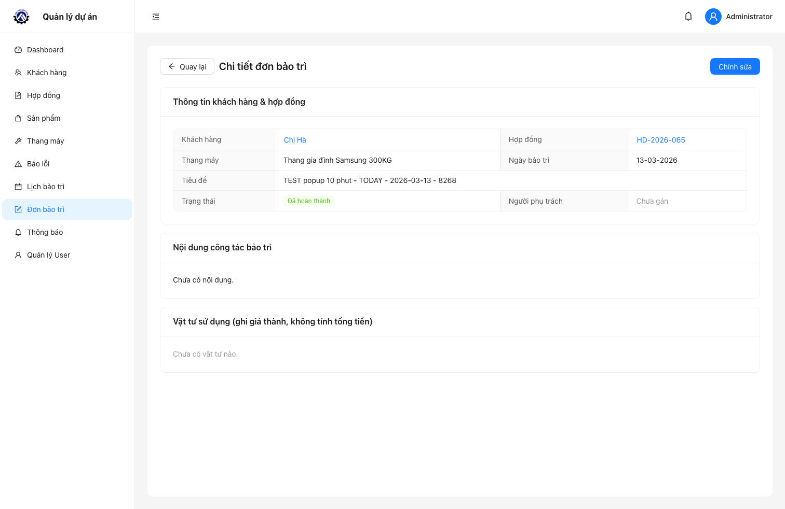

## 6.8 Thông báo

**Mục đích:** cập nhật kịp thời các sự kiện quan trọng trong hệ thống.

**Loại thông báo chính:**

- Nhắc lịch bảo trì định kỳ (`maintenance_schedule_upcoming`).
- Công việc bảo trì mới được giao (`maintenance_order_assigned`).
- Nhắc việc quá hạn (`maintenance_order_overdue`).

**Thao tác thường dùng:**

- Lọc thông báo: tất cả/chưa đọc/đã đọc.
- Mở thông báo để đi nhanh đến công việc liên quan.
- Đánh dấu đã đọc từng thông báo hoặc toàn bộ.
- Xóa thông báo không còn cần thiết.

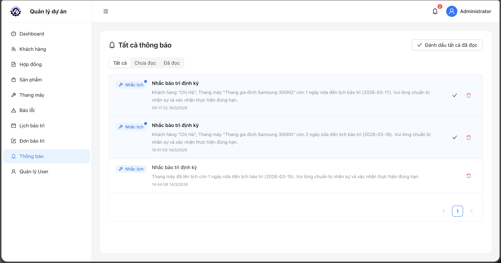

**Logic nghiệp vụ thông báo:**

- Job thông báo chạy 1 lần khi server khởi động và lặp mỗi 24 giờ.
- Nhắc lịch sắp đến hạn:
  - Dựa trên cấu hình `MAINTENANCE_SCHEDULE_NOTIFY_DAYS` (mặc định 3 ngày).
  - Người nhận: Admin + user được gán trong đơn của lịch đó.
- Nhắc việc quá hạn:
  - Áp dụng cho đơn có ngày hẹn < hôm nay và trạng thái chưa hoàn tất.
  - Người nhận: user được gán trên đơn.
- Chống gửi trùng:
  - Mỗi loại thông báo theo người dùng/lịch/ngày tham chiếu chỉ tạo 1 lần.

## 6.9 Quản lý User (chỉ dành cho Admin)

**Mục đích:** quản trị tài khoản và phạm vi truy cập.

**Thao tác thường dùng:**

- Tạo user mới.
- Cập nhật thông tin user.
- Xóa user.
- Kiểm tra vai trò (Quản trị viên/Người dùng).
- Kiểm tra số module được cấp quyền xem.

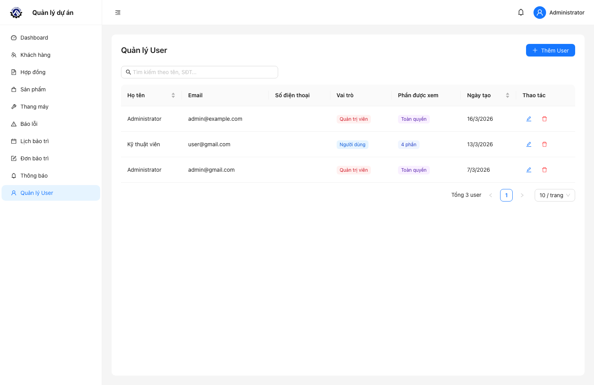

# 7. Quy trình vận hành đề xuất

## 7.1 Quy trình tiếp nhận và xử lý sự cố

1. Tiếp nhận thông tin sự cố từ khách hàng.
2. Tạo báo lỗi và gắn mức độ ưu tiên.
3. Kiểm tra lịch bảo trì liên quan.
4. Admin tạo/phân công đơn bảo trì.
5. Kỹ thuật viên cập nhật tiến độ và kết quả.
6. Đóng sự cố sau khi xác nhận hoàn tất.

## 7.2 Quy trình kiểm soát định kỳ

1. Kiểm tra Dashboard đầu ngày.
2. Rà soát thông báo chưa đọc.
3. Theo dõi danh sách đơn đang thực hiện.
4. Cuối tuần/tháng xuất báo cáo để đối soát nội bộ.

# 8. Câu hỏi thường gặp (FAQ)

## 8.1 Không thấy nút Thêm/Sửa/Xóa?

Tài khoản hiện tại không có quyền Admin cho chức năng đó. Liên hệ quản trị viên để được cấp quyền.

## 8.2 Vì sao không thấy mục "Công việc của tôi"?

Bạn chưa được cấp quyền module tương ứng hoặc chưa được phân công đơn bảo trì.

## 8.3 Đã tạo báo lỗi nhưng không thấy trên lịch?

Báo lỗi chỉ hiển thị trên lịch khi có trường **ngày hẹn** (`scheduled_date`).

## 8.4 Cách đồng bộ lịch sang Google Calendar?

Vào **Lịch bảo trì** → chọn **Copy link chia sẻ** → thêm lịch bằng URL trong Google Calendar.

# 9. Đầu mối hỗ trợ

Khi gửi yêu cầu hỗ trợ, vui lòng cung cấp:

- Tên tài khoản đang sử dụng.
- Thời điểm phát sinh lỗi.
- Phân hệ gặp lỗi.
- Ảnh chụp màn hình/clip ngắn (nếu có).

Thông tin đầy đủ sẽ giúp đội vận hành xử lý nhanh và chính xác hơn.

